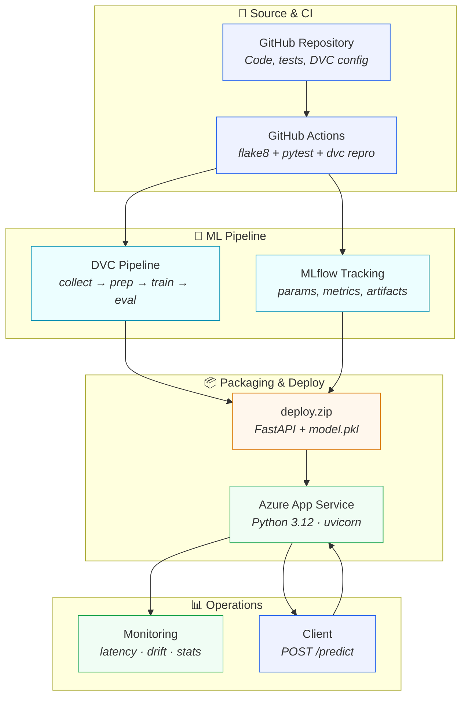
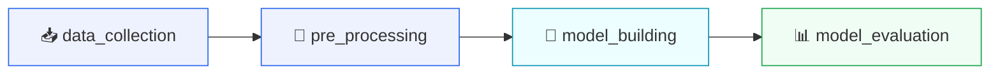
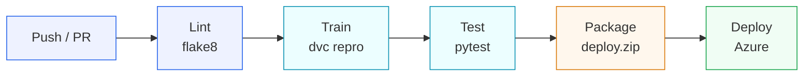

<div align="center">

# 💧 Water Potability MLOps

**End-to-end machine learning operations platform that predicts water potability and deploys to Azure — automatically.**

<br/>

[](https://www.python.org/)
[](https://fastapi.tiangolo.com/)
[](https://dvc.org/)
[](https://mlflow.org/)
[](https://azure.microsoft.com/)
[](https://www.terraform.io/)
[](LICENSE)

<br/>

[Quick Start](#-quick-start) ·
[Architecture](#-architecture) ·
[API](#-api-endpoints) ·
[Deploy](#-deploy-to-azure) ·
[Docs](#-documentation)

</div>

---

## ✨ Highlights

<table>
<tr>
<td width="50%">

### 🎯 What it does
Predicts whether water is **safe to drink** using 9 chemical features — exposed as a production-style REST API with a live monitoring dashboard.

</td>
<td width="50%">

### 🏗️ What it demonstrates
A complete MLOps lifecycle: data versioning, experiment tracking, automated CI/CD, infrastructure-as-code, and post-deployment monitoring.

</td>
</tr>
<tr>
<td>

### ☁️ Where it runs
**Azure App Service (F1 Free)** — tailored for Azure for Students Starter subscriptions at **$0 cost**.

</td>
<td>

### 🔄 How it ships
Push to `main` → GitHub Actions trains, tests, packages, and deploys — no manual steps.

</td>
</tr>
</table>

---

## 📋 Table of Contents

<details open>
<summary><b>Click to expand</b></summary>

- [Overview](#-overview)
- [MLOps Concepts](#-mlops-concepts-implemented)
- [Architecture](#-architecture)
- [Tech Stack](#-tech-stack)
- [Project Structure](#-project-structure)
- [Quick Start](#-quick-start)
- [DVC Pipeline](#-dvc-pipeline)
- [API Endpoints](#-api-endpoints)
- [Testing](#-testing)
- [CI/CD Pipeline](#-cicd-pipeline)
- [Deploy to Azure](#-deploy-to-azure)
- [Documentation](#-documentation)
- [Limitations](#-limitations)
- [Roadmap](#-roadmap)
- [License](#-license)

</details>

---

## 🔍 Overview

> **Can this water be consumed safely?**

This project uses machine learning to answer that question from chemical measurements — and wraps the entire workflow in production-grade MLOps practices.

| Feature | Input |
|---------|-------|
| **pH** | Acidity / alkalinity |
| **Hardness** | Mineral content |
| **Solids** | Total dissolved solids |
| **Chloramines** | Disinfectant levels |
| **Sulfate** | Sulfate concentration |
| **Conductivity** | Electrical conductivity |
| **Organic Carbon** | Organic matter |
| **Trihalomethanes** | Disinfection byproducts |
| **Turbidity** | Water clarity |

**What you get out of the box:**

| Capability | Tool |
|------------|------|
| 📦 Data & pipeline versioning | **DVC** |
| 📊 Experiment tracking | **MLflow** |
| 🚀 Model serving + monitoring | **FastAPI** |
| ⚙️ Automated CI/CD | **GitHub Actions** |
| 🏛️ Cloud infrastructure | **Terraform + Azure** |

---

## 🧠 MLOps Concepts Implemented

<table>
<thead>
<tr>
<th align="left">Concept</th>
<th align="left">Implementation</th>
</tr>
</thead>
<tbody>
<tr>
<td>📁 <b>Data Versioning</b></td>
<td>DVC stages track raw data, processed data, and model outputs with explicit dependencies</td>
</tr>
<tr>
<td>🔬 <b>Experiment Tracking</b></td>
<td>MLflow logs hyperparameters, metrics, and model artifacts during training</td>
</tr>
<tr>
<td>🔗 <b>Pipeline Orchestration</b></td>
<td><code>dvc.yaml</code> defines ordered stages: collect → preprocess → train → evaluate</td>
</tr>
<tr>
<td>🔄 <b>CI/CD for ML</b></td>
<td>GitHub Actions runs linting, tests, <code>dvc repro</code>, packaging, and deployment</td>
</tr>
<tr>
<td>🏗️ <b>Infrastructure as Code</b></td>
<td>Terraform provisions Azure Resource Group, App Service Plan, and Web App</td>
</tr>
<tr>
<td>🌐 <b>Model Serving</b></td>
<td>FastAPI exposes <code>/predict</code> with API key protection</td>
</tr>
<tr>
<td>📡 <b>Monitoring</b></td>
<td>In-memory prediction logs track latency, class distribution, and feature drift</td>
</tr>
</tbody>
</table>

---

## 🏛️ Architecture



> **Request path:** `Client` → `POST /predict` → `FastAPI` → model inference → response + monitoring logs

📄 See [docs/azure-architecture.md](docs/azure-architecture.md) for Azure-specific details.

---

## 🛠️ Tech Stack

<p align="center">
  
  
  
  
  
  
  
  
  
  
</p>

| Layer | Tools |
|:------|:------|
| **Language** | Python 3.12 |
| **ML** | scikit-learn, pandas, numpy |
| **Pipeline** | DVC |
| **Tracking** | MLflow (SQLite) |
| **API** | FastAPI, uvicorn, Pydantic |
| **CI/CD** | GitHub Actions |
| **Infra** | Terraform, Azure App Service (F1) |
| **Testing** | pytest, flake8 |

---

## 📁 Project Structure

```
MLops/
│
├── .github/workflows/
│   └── mlops.yml              # ⚙️  CI/CD pipeline
│
├── data/
│   ├── external/              # 📥 Source dataset
│   ├── raw/                   # 📦 DVC: collected data
│   └── processed/             # 🔧 DVC: preprocessed data
│
├── deploy_pkg/                # 📤 Packaged app for Azure
├── docs/                      # 📚 Architecture & MLOps guides
│
├── infra/                     # ☁️  Terraform (Azure)
│   ├── main.tf
│   ├── variables.tf
│   └── outputs.tf
│
├── models/                    # 🤖 Trained model (model.pkl)
├── reports/                   # 📊 Metrics & MLflow run IDs
│
├── src/
│   ├── data/                  # Data collection & preprocessing
│   ├── models/                # Training & evaluation
│   ├── templates/             # Monitoring dashboard HTML
│   ├── data_model.py          # Pydantic request schema
│   └── main.py                # 🚀 FastAPI application
│
├── tests/                     # ✅ API & artifact tests
├── dvc.yaml                   # Pipeline definition
├── params.yaml                # Hyperparameters
├── requirements.txt           # Dev/training deps
└── requirements-serve.txt     # Production serving deps
```

---

## 🚀 Quick Start

### Prerequisites

| Requirement | Link |
|-------------|------|
| Python 3.12+ | [python.org](https://www.python.org/) |
| DVC | `pip install dvc` |
| Azure CLI *(deploy only)* | [Install guide](https://learn.microsoft.com/en-us/cli/azure/install-azure-cli) |
| Terraform >= 1.5 *(deploy only)* | [terraform.io](https://www.terraform.io/) |

### Run locally

```bash
# 1. Clone
git clone <repo-url> && cd MLops

# 2. Setup environment
python -m venv .venv
source .venv/bin/activate        # Windows: .venv\Scripts\activate
pip install -r requirements.txt

# 3. Train the model
dvc repro

# 4. Start the API
uvicorn src.main:app --reload --port 8000
```

### Local endpoints

| | Endpoint | URL |
|:---:|:---------|:----|
| 📖 | Swagger docs | http://127.0.0.1:8000/docs |
| 💚 | Health check | http://127.0.0.1:8000/health |
| 📊 | Dashboard | http://127.0.0.1:8000/dashboard |

### Sample prediction

```bash
curl -X POST "http://127.0.0.1:8000/predict" \
  -H "Content-Type: application/json" \
  -d '{
    "ph": 7.0, "Hardness": 200, "Solids": 20000,
    "Chloramines": 7, "Sulfate": 300, "Conductivity": 400,
    "Organic_carbon": 15, "Trihalomethanes": 60, "Turbidity": 4
  }'
```

---

## 🔗 DVC Pipeline



**Configuration** — `params.yaml`:

```yaml
data_collection:
  test_size: 0.20
model_building:
  model_type: "logistic_regression"
  n_estimators: 100
```

| Stage | Script | Output |
|:------|:-------|:-------|
| `data_collection` | `src/data/data_collection.py` | `data/raw/` |
| `pre_processing` | `src/data/data_prep.py` | `data/processed/` |
| `model_building` | `src/models/model_building.py` | `models/model.pkl` |
| `model_evaluation` | `src/models/model_eval.py` | `reports/metrics.json` |

```bash
dvc repro                  # Run full pipeline
dvc repro model_building   # Run single stage
dvc dag                    # View pipeline graph
```

---

## 🌐 API Endpoints

| Method | Endpoint | Auth | Description |
|:------:|:---------|:----:|:------------|
| `GET` | `/` | — | API info and available endpoints |
| `GET` | `/health` | — | Model load status |
| `POST` | `/predict` | 🔑 | Predict water potability |
| `GET` | `/dashboard` | — | HTML monitoring dashboard |
| `GET` | `/api/monitoring-stats` | — | Latency, drift, and prediction stats |
| `POST` | `/api/simulate` | 🔑 | Simulate normal or drifted traffic |
| `POST` | `/api/clear-logs` | 🔑 | Clear in-memory prediction logs |

<details>
<summary><b>📄 Request schema (Water model)</b></summary>

```json
{
  "ph": 7.0,
  "Hardness": 200.0,
  "Solids": 20000.0,
  "Chloramines": 7.0,
  "Sulfate": 300.0,
  "Conductivity": 400.0,
  "Organic_carbon": 15.0,
  "Trihalomethanes": 60.0,
  "Turbidity": 4.0
}
```

</details>

---

## ✅ Testing

```bash
python -m pytest tests/ -v    # Run all tests
flake8 src/                   # Lint
```

Covers API health, predictions, API key enforcement, monitoring stats, and artifact helpers.

---

## ⚙️ CI/CD Pipeline



Triggered on every push/PR to `main` or `master`.

Workflow: [`.github/workflows/mlops.yml`](.github/workflows/mlops.yml)

---

## ☁️ Deploy to Azure

> [!NOTE]
> Azure for Students Starter only allows `Microsoft.Web` and `Microsoft.Insights`. This setup uses **App Service F1 (Free)** — no Storage, ACR, or Key Vault required.

### Step 1 — Login

```bash
az login && az account show
```

### Step 2 — Provision infrastructure

```bash
cd infra
cp terraform.tfvars.example terraform.tfvars
# Set subscription_id to match `az account show`

terraform init -upgrade
terraform apply
```

Creates: **Resource Group** · **App Service Plan (F1)** · **Linux Web App** · **Application Insights**

### Step 3 — GitHub secrets

| Secret | Value |
|:-------|:------|
| `AZURE_WEBAPP_NAME` | `terraform output -raw webapp_name` |
| `AZURE_WEBAPP_PUBLISH_PROFILE` | XML from command below |

```bash
az webapp deployment list-publishing-profiles \
  --name "$(terraform output -raw webapp_name)" \
  --resource-group "$(terraform output -raw resource_group)" \
  --xml
```

### Step 4 — Deploy

Push to `main` — CI trains, packages, and deploys automatically.

### Step 5 — Test live API

```bash
API_URL=$(cd infra && terraform output -raw api_url)
API_KEY=$(cd infra && terraform output -raw api_key)

curl -X POST "$API_URL/predict" \
  -H "X-API-Key: $API_KEY" \
  -H "Content-Type: application/json" \
  -d '{"ph":7,"Hardness":200,"Solids":20000,"Chloramines":7,"Sulfate":300,"Conductivity":400,"Organic_carbon":15,"Trihalomethanes":60,"Turbidity":4}'
```

### Tear down

```bash
cd infra && terraform destroy
```

---

## 📚 Documentation

| Document | Description |
|:---------|:------------|
| [azure-architecture.md](docs/azure-architecture.md) | Azure services, limitations, and request path |
| [MLOps_Document_Style_Guide_v2.pdf](docs/MLOps_Document_Style_Guide_v2.pdf) | MLOps concepts and implementation guide |
| [MLOps_From_Scratch_Concepts_And_Project_Architecture.pdf](docs/MLOps_From_Scratch_Concepts_And_Project_Architecture.pdf) | Beginner-friendly MLOps walkthrough |

---

## ⚠️ Limitations

| Limitation | Detail |
|:-----------|:-------|
| 🥶 Cold starts | F1 App Service may sleep after inactivity |
| 📊 MLflow UI | Tracking uses SQLite in CI, not a managed server |
| 📦 Model packaging | Model is baked into each deploy zip — no shared artifact store |
| 🔒 Starter constraints | Blob Storage, ACR, Key Vault, Container Apps unavailable |
| 💾 In-memory logs | Prediction logs reset on restart (ring buffer of 1000) |

---

## 🗺️ Roadmap

- [ ] Model promotion workflow (dev → staging → production)
- [ ] Automated retraining on drift thresholds
- [ ] Managed artifact storage and MLflow tracking server
- [ ] Canary / blue-green deployment strategies
- [ ] Data quality validation gates (Great Expectations)
- [ ] Alerting and SLO dashboards

---

## 📄 License

MIT — see [LICENSE](LICENSE).

---

<div align="center">

**Built with ❤️ to demonstrate real-world MLOps on Azure**

<br/>

⭐ Star this repo if you found it useful!

</div>
